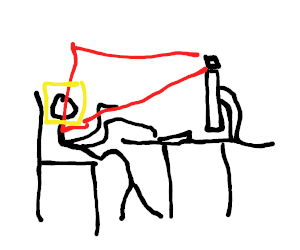

# posture-reminder

Uses face recognition to remind you to sit up straight

## Usage

WARNING: This project is still a work in progress. It doesn't work yet!



run `./posture_reminder`

| Key              | Description                |
|------------------|----------------------------|
| <kbd>esc</kbd>   | quit w                     |
| <kbd>space</kbd> | Set the desired position.  |

## Installation

1. Make sure you have the following software:
    - opencv: https://opencv.org/releases/
    - a C++ compiler

2. Clone this repository or download it as a zip file

2. Build:

| Tool          | Description                  | OS      |
|---------------|------------------------------|---------|
| Visual Studio | Can simply open this project | Windows |
| CLion         | Can simply open this project | any     |
| cmake         | see below                    | any     |
| g++           | `sh compile.sh`              | Linux   |

### cmake

Figure out if you have a single or multi configuration generator:

```shell
cmake --help
cmake --help-property GENERATOR_IS_MULTI_CONFIG
```

For single-config-generators such as `Unix Makefiles` and `Ninja`:

```shell
cmake -S "." -B "build/Release" -D CMAKE_BUILD_TYPE=Release
cmake --build "build/Release"
```

For multi-config-generators such as `Ninja Multi-Config` and `Visual Studio`:

```shell
cmake -S . -B build
cmake --build build --config Release
```
